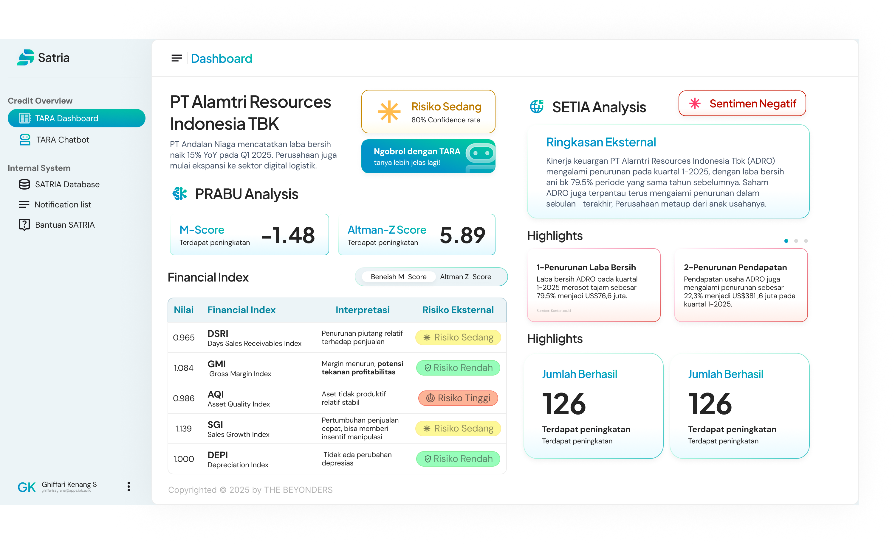

# SATRIA - Credit Risk Analysis System

[](https://satria-sanf.vercel.app)
[](https://nextjs.org/)
[](https://www.typescriptlang.org/)
[](https://firebase.google.com/)
[](https://vercel.com/)

SATRIA (Sistem Analisis Risiko Kredit Terintegrasi dan Adaptif) adalah platform analisis risiko kredit modern yang mengintegrasikan teknologi AI untuk memberikan penilaian kredit yang akurat dan komprehensif. Sistem ini menggunakan **Firestore** sebagai database utama dan **Cloudflare R2** untuk penyimpanan file yang aman dan efisien. 

## 🌐 Demo Online

**🚀 Aplikasi SATRIA sudah dapat diakses di:** [**satria-sanf.vercel.app**](https://satria-sanf.vercel.app)

> Platform kredit risk analysis yang terintegrasi dengan teknologi AI untuk analisis dokumen keuangan secara otomatis dan real-time dashboard monitoring.

## 🚀 Fitur Utama

- **SARANA**: OCR & NLP untuk ekstraksi data dokumen keuangan
- **PRABU**: Credit Scoring AI dengan M-Score dan Altman Z-Score
- **SETIA**: Sentiment Analysis & News Monitoring
- **TARA**: Dashboard & Chatbot untuk interaksi pengguna

## 📸 Showcase Aplikasi

### 🏠 Landing Page

*Halaman utama SATRIA dengan desain modern dan informasi lengkap tentang platform analisis risiko kredit*

### 📈 Applications Dashboard

*Tabel lengkap semua pengajuan kredit dengan status, risk assessment, dan detail analisis per aplikasi*

**Project masih dalam tahap pengembangan dan belum sempurna!**

## 🛠️ Teknologi

### Frontend
- **Next.js 14** (App Router)
- **TypeScript**
- **Tailwind CSS**
- **shadcn/ui** + **Radix UI**
- **React Hook Form** + **Zod**
- **Sonner** (Toast notifications)

### Backend & Database
- **Firebase Firestore** (Database)
- **Cloudflare R2** (File Storage)
- **Next.js API Routes**

### AI & Integration
- **Google Gemini AI** (Chatbot)
- **FastAPI** (Python backend - optional)

## 📦 Instalasi

### 1. Clone Repository
```bash
git clone https://github.com/your-org/satria-credit-risk.git
cd satria-credit-risk
```

### 2. Install Dependencies
```bash
npm install
# atau
yarn install
# atau
pnpm install
```

### 3. Setup Environment Variables
Salin file `.env.example` ke `.env.local`:
```bash
cp .env.example .env.local
```

Isi semua environment variables yang diperlukan:

#### Firebase Configuration
1. Buat project di [Firebase Console](https://console.firebase.google.com)
2. Enable Firestore Database
3. Dapatkan konfigurasi web app
4. Buat service account untuk admin SDK

#### Cloudflare R2 Configuration
1. Buat akun di [Cloudflare](https://cloudflare.com)
2. Buat R2 bucket
3. Dapatkan API credentials
4. Setup public access untuk bucket

#### Gemini AI Configuration
1. Dapatkan API key dari [Google AI Studio](https://makersuite.google.com)

## 🏗️ Arsitektur Sistem

### Database Schema (Firestore)
```
Firestore Collections:
├── applications/          # Credit applications
│   ├── {applicationId}    # Application document
│   └── subcollections/    # Related data
├── documents/             # File metadata
│   └── {documentId}       # Document metadata
├── systemStats/           # System statistics
│   └── main               # Main stats document
└── chatHistory/           # Chat conversations
   └── {userId}           # User chat history
```

### File Storage (Cloudflare R2)
```
SATRIA Application
├── Frontend (Next.js)
│   ├── Multi-step Form
│   ├── File Upload Component
│   └── Real-time Dashboard
├── Backend API Routes
│   ├── /api/applications (CRUD)
│   ├── /api/upload (File Upload)
│   └── /api/stats (Statistics)
├── Firestore Database
│   ├── applications (Application data)
│   ├── documents (File metadata)
│   └── systemStats (System metrics)
├── Cloudflare R2 Storage
│   ├── /documents (Financial docs)
│   ├── /images (Company logos)
│   └── /reports (Analysis results)
└── External Services
   ├── OCR Service (SARANA)
   ├── Credit Scoring (PRABU)
   └── Sentiment Analysis (SETIA)
```

### Data Flow

1. **Form Submission**: User fills multi-step form
2. **Validation**: Client-side validation with Zod
3. **API Call**: Data sent to `/api/applications`
4. **Firestore Save**: Application saved to Firestore
5. **File Upload**: Documents uploaded to R2
6. **Metadata Save**: File metadata saved to Firestore
7. **Analysis**: Background processing with AI modules
8. **Real-time Updates**: Dashboard updates via Firestore listeners

## 🔧 Konfigurasi

### Firestore Rules
Update rules di Firebase Console:
```javascript
// Lihat database/firestore.rules untuk rules lengkap
rules_version = '2';
service cloud.firestore {
  match /databases/{database}/documents {
    // Applications - allow read/write for all authenticated users
    match /applications/{applicationId} {
      allow read, write: if true; // For development, adjust for production
    }
    
    // Documents - allow read/write for all authenticated users
    match /documents/{documentId} {
      allow read, write: if true; // For development, adjust for production
    }
    
    // System stats - allow read for all, write for admin only
    match /systemStats/{document} {
      allow read: if true;
      allow write: if true; // For development, adjust for production
    }
  }
}
```

### Cloudflare R2 CORS
Setup CORS policy untuk bucket R2:
```json
[
   {
      "AllowedOrigins": ["http://localhost:3000", "https://yourdomain.com"],
      "AllowedMethods": ["GET", "PUT", "POST", "DELETE"],
      "AllowedHeaders": ["*"]
   }
]
```

### Cloudflare R2 CORS
Setup CORS policy untuk bucket R2:

## 📱 Penggunaan

### 1. Landing Page
- Informasi tentang SATRIA
- Navigasi ke form aplikasi
- Link ke dashboard

### 2. Form Aplikasi
- Multi-step form untuk data perusahaan
- Upload dokumen pendukung
- Validasi data dengan Zod

### 3. Dashboard
- Overview statistik aplikasi
- Tabel semua pengajuan
- Analisis risiko per perusahaan

### 4. Chatbot TARA
- Integrasi dengan Gemini AI
- Bantuan untuk pengguna
- Analisis dokumen

### Security Best Practices

1. **Firestore Security Rules**
   - Implement proper authentication
Create the following indexes in Firestore:
   \`\`\`

3. **Form Submission Errors**
   \`\`\`bash
   # Check form validation
   # Verify API endpoint is working
   # Check Firestore connection
   \`\`\`

### Debug Mode

\`\`\`env
# Enable detailed logging
DEBUG=true
NODE_ENV=development
\`\`\`

## 📄 License

Distributed under the MIT License. See `LICENSE` for more information.

Built with ❤️ by **The Beyonders** | © 2025